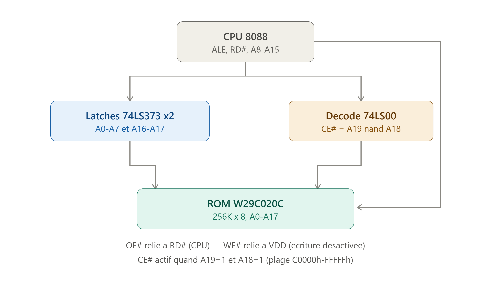

## Vue d'ensemble

Voici un schéma de principe des connexions :

Le 8088 multiplexe une partie de son bus d'adresses avec les données et les status, donc il faut du matériel de démultiplexage entre le CPU et la ROM.

## Détail du câblage

**Bus d'adresses multiplexé (AD0-AD7)**
Ces 8 broches du CPU (pins 9-16 en boîtier DIP) portent l'adresse en début de cycle bus, puis les données ensuite. Il faut les **latcher** avec un `74LS373` (ou `74LS573`) déclenché par **ALE** (Address Latch Enable, pin 25) pour récupérer A0-A7 de façon stable → connecté à **A0-A7 de la ROM** (pins 12, 11, 10, 9, 8, 7, 6, 5).

**Bus d'adresses/status multiplexé (A16-A19/S3-S6)**
Pareil : ces 4 broches (pins 35-38) sont multiplexées avec des bits de status en mode max. Un second `74LS373` latché par ALE isole **A16 et A17** → connectés à **A16 (pin 2) et A17 (pin 30) de la ROM**. (A18-A19 latchés servent uniquement au décodage, pas à la ROM qui n'a que 18 lignes d'adresse.)

**Bus d'adresses direct (A8-A15)**
Ces broches (pins 22-24, 17-21 en DIP) sont **déjà stables** pendant tout le cycle bus — pas besoin de latch. Connecter **directement** aux entrées **A8-A15 de la ROM** (pins 4, 27, 26, 23, 25, 28, 29, 3 — l'ordre n'est pas séquentiel sur le boîtier, vérifie bien le brochage).

**Décodage du CE# (Chip Enable)**
Ta ROM occupe C0000h-FFFFFh, soit le quart supérieur du méga-octet adressable : cela correspond exactement à **A19=1 ET A18=1**. Une simple porte **NAND 74LS00** (2 entrées : A19 latché, A18 latché) donne directement un signal actif bas quand les deux sont hauts → branche sa sortie sur **CE# (pin 22)** de la ROM.

**OE# et WE#**
- **OE#** (pin 24) ← **RD#** du CPU (pin 32 en min mode) : la ROM ne sort ses données que pendant une vraie lecture.
- **WE#** (pin 31) ← **VDD** (+5V) en permanence : désactive toute écriture accidentelle pendant le fonctionnement normal. Pour reprogrammer la puce, il faudra soit la retirer et utiliser un programmateur externe, soit prévoir un jumper qui reconnecte WE# au WR# du CPU en mode "programmation".

## Point de vigilance

Vérifie que **IO/M#** (pin 28 du 8088) ne doit **pas** activer la ROM pendant les cycles d'E/S — dans ce montage, comme le décodage se fait uniquement sur A18/A19 (qui n'existent pas dans l'espace I/O 16 bits séparé du 8088), il n'y a normalement pas de conflit. Mais si ton design utilise des cycles d'E/S 20 bits étendus ou une autre topologie de bus, ajoute **IO/M#** comme troisième entrée du NAND (via porte NAND 3 entrées type `74LS10`) pour garantir CE# actif uniquement en cycle mémoire.