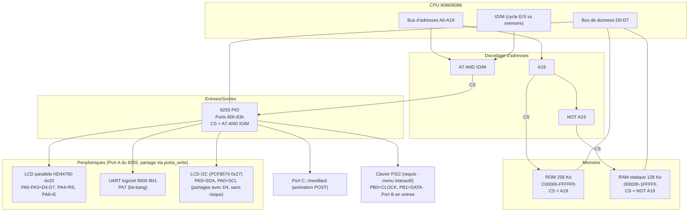

# Solution-01 — 8088/8086 sur breadboard (VE2CUY)

Firmware ROM pour un ordinateur 8088/8086 assemblé sur breadboard par
Alain Boudreault (VE2CUY). Au démarrage, la carte :

1. affiche la version de l'application et les paramètres de la
   connexion UART sur un second LCD, piloté en I2C logiciel (bit-bang) ;
2. affiche un écran de démarrage sur le LCD parallèle 4×20 pendant
   1 seconde ;
3. affiche un **menu interactif** (UART + LCD), piloté au clavier
   PS/2, qui reste le comportement normal de la carte tant qu'elle
   est sous tension — voir [Menu interactif](#menu-interactif)
   ci-dessous pour la structure complète.

Contrairement aux versions précédentes, il n'y a plus de "power-on
self-test" (POST) qui s'enchaîne automatiquement — chaque test (RAM,
dump ROM/RAM, animation du Port C, édition de la RAM) est maintenant
déclenché explicitement depuis le menu. Le clavier PS/2 est donc
**requis** pour que la carte fasse quoi que ce soit après le splash.

## Matériel visé

- CPU 8088/8086 (le code est écrit pour être compatible 8086 strict —
  voir `CPU 8086` dans `solution-01.asm` — mais ciblé pour tourner sur
  un vrai 8088)
- ROM 256 Ko, mappée à l'adresse physique `C0000h-FFFFFh`
- RAM statique 128 Ko
- Un 8255 (PIO) : Port A entièrement occupé (LCD parallèle, UART
  logiciel et LCD I2C logiciel), Port C utilisé pour l'animation du
  POST, **Port B en entrée en permanence** (clavier PS/2 — requis
  pour le menu interactif, voir plus bas)
- Câblage du Port A (voir l'en-tête de `solution-01.asm`) — **les 8
  bits sont utilisés** :
  - `PA0` → `D4` du LCD parallèle **ET** `SCL` du LCD I2C (broche
    partagée — voir `lib/lcd_i2c.asm` : sans risque, car le HD44780
    ne capture les lignes de données que sur un front descendant de
    `E`, jamais touchée par le module I2C)
  - `PA1-PA3` → `D5-D7` du LCD parallèle
  - `PA4` → `RS` du LCD parallèle
  - `PA5` → `SDA` du LCD I2C (PCF8574)
  - `PA6` → `E` du LCD parallèle (dédiée, jamais touchée par le module I2C)
  - `PA7` → ligne UART (remplace un ancien latch 74LS373 externe)
- LCD parallèle HD44780 4 lignes × 20 caractères, piloté en mode 4 bits
- LCD I2C HD44780 (derrière un expandeur PCF8574, adresse `0x27` —
  "backpack" standard), piloté en I2C logiciel
- Clavier PS/2 (**requis** — voir [Menu interactif](#menu-interactif)) :
  `PB0` = `CLOCK`, `PB1` = `DATA`, résistances de tirage externes requises

Comme le LCD parallèle, l'UART et le LCD I2C se partagent le même
octet matériel (le 8255 en mode 0 n'adresse pas le Port A bit à bit),
toute écriture sur ce port passe par `porta_write` (voir
`lib/common.asm`), qui ne modifie que les bits concernés et préserve
les autres via une copie fantôme en RAM.

## Schéma bloc du circuit électronique

Décodage d'adresses (logique simple, sans décodeur dédié — un seul
bit d'adresse suffit à distinguer ROM/RAM, la sélection du 8255 se
faisant sur le bus d'E/S) :

- **ROM** : `CS = A19`
- **RAM** : `CS = NOT A19`
- **8255 (PIO)** : `CS = A7 AND IO/M` (cycle d'E/S, adresse ≥ 80h —
  `A0`/`A1` vont directement aux broches `A0`/`A1` du 8255 pour
  sélectionner Port A/B/C/registre de commande — voir `PORTA`/`PORTB`/
  `PORTC`/`PIO` dans `include/hardware.inc`, ports 80h-83h)



⚠️ Note : la sélection de la ROM ne dépend que de `A19` (pas de
`A18`) — la ROM physique (256 Ko = `A0-A17`) est donc mise en miroir
sur les 512 Ko de la moitié haute de l'espace mémoire (`80000h-FFFFFh`)
si `A18` n'est câblé nulle part ailleurs ; le firmware n'utilise que
la fenêtre `C0000h-FFFFFh`. Même remarque pour la RAM (128 Ko, moitié
basse de 1 Mo) : seuls `00000h-1FFFFh` sont réellement testés par
`test_ram` (voir `solution-01.asm`).

## Structure du dossier

```
Solution-01/
├── solution-01.asm       Flux principal (start, test RAM, dump ROM,
│                          animation 8255) + tous les textes/données
├── Directives.md          Cahier des charges du projet
├── Makefile               Automatise l'assemblage (voir Makefile.md)
├── Makefile.md            Explication détaillée du Makefile
├── check_rom.py           Validation structurelle du .bin assemblé
├── .gitignore             Ignore build/ (fichiers jetables de check-modules)
├── include/
│   ├── hardware.inc       Constantes matérielles (8255, adresses RAM
│   │                      des variables partagées)
│   ├── delay.inc          Macro `delay_ms` (voir lib/utils.asm)
│   └── lcd_macros.inc     Macros `lcd_goto`/`lcd_show`/`i2c_lcd_goto`/
│                          `i2c_lcd_show` + `gotoxy`/`print` (INT 10h -
│                          voir plus bas)
└── lib/
    ├── common.asm         porta_write (accès partagé LCD/UART/LCD-I2C
    │                      au Port A) + hex_table
    ├── lcd.asm            Toutes les procédures d'affichage du LCD parallèle
    ├── uart.asm           Toutes les procédures de transmission UART
    ├── utils.asm          delay_ms_proc (routine derrière la macro)
    ├── lcd_i2c.asm        Accès I2C logiciel (bit-bang) au LCD PCF8574 0x27
    ├── ps2.asm            Lecture d'un clavier PS/2 en polling (TEST_PS2)
    └── bin/                (généré) lcd.bin, uart.bin, lcd_i2c.bin, ps2.bin
```

Fichiers générés par `make` (non versionnés, voir `.gitignore`) :
`solution-01.bin`, `lib/bin/lcd.bin`, `lib/bin/uart.bin`,
`lib/utils.bin`, `lib/bin/lcd_i2c.bin`, `lib/bin/ps2.bin`, `build/check/*.bin`.

**Règle importante** : tous les `%include` du projet sont écrits comme
des chemins relatifs à **cette racine** (`Solution-01/`), jamais
relatifs au fichier qui fait le `%include` — NASM résout les chemins
par rapport au répertoire courant au moment de l'assemblage. Il faut
donc toujours lancer `nasm`/`make` **depuis ce dossier**, jamais depuis
un sous-dossier.

## Fonctions d'accès au LCD (`lib/lcd.asm`)

| Fonction | Rôle |
|---|---|
| `lcd_init` | Séquence d'initialisation HD44780 standard en 4 bits (4 lignes × 20, curseur off, Clear Display) |
| `lcd_command` / `lcd_data` | Envoie un octet complet (2 quartets) : `lcd_command` = instruction (RS=0), `lcd_data` = caractère (RS=1). Entrée : `AL` |
| `lcd_strobe` | Envoie un quartet déjà prêt et génère l'impulsion `E` (via `porta_write`, jamais un `out` direct — préserve le bit UART) |
| `lcd_print` | Affiche une chaîne terminée par `0` depuis `DS:SI` (pas de padding — le texte doit déjà avoir la largeur voulue) |
| `lcd_tx_hex_nibble` / `lcd_tx_hex_byte` / `lcd_tx_hex_word` | Affiche une valeur en hexadécimal majuscule (entrée : `AL` ou `AX`) — générées par `def_tx_hex_nibble`/`byte`/`word` (voir [Macros de refactoring](#macros-de-refactoring)) |

Positionnement DDRAM (anciennement `lcd_line1..4`/`lcd_show_line1..4`) :
voir les macros `lcd_goto`/`lcd_show` ci-dessous.
| `lcd_tx_dec3` | Affiche `AX` (0-999) en décimal, toujours sur 3 chiffres avec zéros de tête |
| `lcd_short_delai` / `lcd_delay` / `lcd_delay_long` / `lcd_powerup_delay` | Délais calibrés au plus proche du minimum HD44780 (voir en-tête du fichier pour les marges de sécurité de chacun) |

## Fonctions d'accès à l'UART (`lib/uart.asm`)

Transmission série logicielle (bit-bang, 9600 8N1) sur `PA7`.

| Fonction | Rôle |
|---|---|
| `uart_tx_string` | Transmet une chaîne terminée par `0` depuis `DS:SI` |
| `uart_tx_byte` | Transmet `AL` en 8N1 (bit start, 8 bits LSB en premier, bit stop) via `porta_write` |
| `uart_bit_delay` | Délai d'un bit, calibré (`UART_BIT_COUNT`) pour ~9600 bauds — **valeur mesurée à l'analyseur logique sur ce montage, ne pas modifier sans re-mesurer** — généré par `def_busy_delay` |
| `uart_tx_hex_nibble` / `uart_tx_hex_byte` / `uart_tx_hex_word` | Affiche une valeur en hexadécimal majuscule (entrée : `AL` ou `AX`) — généré par `def_tx_hex_nibble`/`byte`/`word` |

## Fonctions d'accès au LCD I2C (`lib/lcd_i2c.asm`)

Second LCD HD44780, derrière un expandeur I2C PCF8574 (adresse
`0x27`), piloté en I2C **logiciel** (bit-bang) sur `SDA=PA5` /
`SCL=PA0` (`PA0` partagée avec `D4` du LCD parallèle, mais **sans
risque** : le HD44780 ne capture les lignes de données que sur un
front descendant de `E` — jamais touchée par ce module — donc le
trafic I2C lui est invisible. **`i2c_lcd_*` peut être appelé
n'importe où dans le projet**, même pendant un affichage actif sur
le LCD parallèle, sans avoir besoin d'un `lcd_init` après coup — voir
l'en-tête de `lib/lcd_i2c.asm` pour le détail, y compris l'essai
initial avec `SCL` sur `PA6`/`E`, abandonné pour cette raison). Le
Port A du 8255 étant configuré tout en sortie (push-pull, pas
open-drain), cette implémentation **n'accuse jamais réception (ACK)**
— voir l'en-tête du fichier pour le détail.

| Fonction | Rôle |
|---|---|
| `i2c_lcd_init` | Séquence d'initialisation HD44780 standard en 4 bits, via le PCF8574 |
| `i2c_lcd_command` / `i2c_lcd_data` | Envoie un octet complet au LCD I2C (voir `i2c_lcd_send_byte`). Entrée : `AL` |
| `i2c_lcd_send_byte` | Envoie 2 quartets × 3 états `EN` en **une seule transaction I2C** (1 START + adresse + 6 octets de données + 1 STOP) |
| `i2c_lcd_strobe` | Envoie un quartet + `RS` avec l'impulsion `EN`, en une seule transaction I2C (1 START + adresse + 3 octets + STOP) |
| `i2c_lcd_print` | Affiche une chaîne terminée par `0` depuis `DS:SI` |
| `i2c_lcd_tx_hex_nibble` / `i2c_lcd_tx_hex_byte` | Affiche une valeur en hexadécimal majuscule (entrée : `AL`) — généré par `def_tx_hex_nibble`/`byte` |
| `i2c_write_byte` | Transmet un octet (8 bits, MSB en premier) sur le bus I2C |
| `i2c_start` / `i2c_stop` | Conditions START/STOP du protocole I2C |
| `i2c_delay` | Demi-période SCL (~3,77 µs → ~88,5 kHz, sous le maximum 100 kHz du mode I2C "standard", marge ~13%) — généré par `def_busy_delay` |

Positionnement DDRAM (anciennement `i2c_lcd_line1..4`/`i2c_lcd_show_line1..4`,
mêmes adresses que le LCD parallèle) : voir les macros `i2c_lcd_goto`/
`i2c_lcd_show` ci-dessous.

⚡ **Optimisations** (quatre passes, voir Directives.md pour l'historique) :
1. Les écritures PCF8574 (états `EN=0/1/0` par quartet) sont regroupées dans
   une seule transaction I2C par appel plutôt qu'une transaction séparée par
   écriture — l'overhead START+adresse+STOP n'est payé qu'une fois par
   quartet (`i2c_lcd_strobe`) ou par octet complet (`i2c_lcd_send_byte`), au
   lieu de 3× ou 6×.
2. `i2c_start`/`i2c_stop`/`i2c_write_byte` lisaient la copie fantôme du Port A
   **une seule fois par appel** (pas par bit) et écrivaient directement sur le
   port (`out`) pour chaque transition SDA/SCL, au lieu de passer par un
   `i2c_set` intermédiaire qui relisait la copie fantôme via `porta_write`
   (lecture-modification-écriture complète, 5 `push`/`pop`) à **chaque bit**
   (~27 fois par octet PCF8574). C'est cette surcharge d'appels de procédure
   — mesurée sur le matériel réel bien plus coûteuse que les délais
   volontaires eux-mêmes — qui dominait le temps total, pas la vitesse
   d'horloge I2C (`i2c_delay`, inchangée).
3. La copie fantôme RAM (`PORTA_SHADOW`) n'est plus utilisée **du tout** par
   ces 3 routines : remplacée par une lecture matérielle directe
   `IN AL, PORTA`. Fiable sur un 8255A authentique (confirmé sur ce
   montage) — un port configuré en sortie renvoie, à la lecture, le contenu
   du **verrou de sortie** (comportement documenté du 8255A ; à revalider si
   le 8255 change un jour pour un clone non garanti équivalent). Élimine le
   passage par `VAR_SEG`/`ES`/`DI` entièrement dans ce module. Sans impact
   sur `porta_write` (LCD parallèle/UART) : aucun de leurs masques ne couvre
   `PA0`(`SCL`)/`PA5`(`SDA`), sauf le LCD parallèle qui écrit toujours
   explicitement son propre bit `D4`/`PA0`. **Gain marginal en pratique** —
   contrairement à l'optimisation 2, celle-ci n'économise que quelques
   instructions par appel, pas par bit.
4. `i2c_delay` réduit de `bx=2` (~44,4 kHz) à `bx=1` (~88,5 kHz) — marge
   ramenée de ~125% à ~13% sous le plafond 100 kHz du mode I2C "standard".
   Réduit le plancher imposé par les ~189 appels à `i2c_delay` par
   transaction (le facteur dominant restant, une fois la surcharge d'appels
   éliminée par l'optimisation 2). **Premier candidat à assouplir**
   (revenir à `bx=2`) si le LCD I2C devient instable sur le matériel réel.

Réutilise `lcd_delay` / `lcd_delay_long` / `lcd_powerup_delay` de
`lib/lcd.asm` pour les temps d'exécution propres au HD44780 (mêmes
exigences, peu importe le transport parallèle ou I2C).

## Macros de refactoring

Plusieurs familles de procédures quasi identiques (LCD parallèle, LCD
I2C, UART) ont été remplacées par des macros NASM — même comportement,
code source bien plus compact. Aucun changement fonctionnel : les
octets assemblés sont identiques pour les générateurs (`def_tx_hex_*`,
`def_busy_delay`, `lcd_text`) et légèrement plus nombreux mais
équivalents pour les macros inline (`lcd_goto`/`lcd_show`,
`ascii_or_dot`), qui remplacent un `call` vers une procédure partagée
par du code répété à chaque site d'appel.

| Macro | Fichier | Remplace | Rôle |
|---|---|---|---|
| `lcd_goto LCD_LINEn` | `include/lcd_macros.inc` | `call lcd_line1`…`lcd_line4` | Positionne le curseur DDRAM (LCD parallèle) |
| `lcd_show LCD_LINEn` | `include/lcd_macros.inc` | `call lcd_show_line1`…`lcd_show_line4` | `lcd_goto` + `lcd_print` (entrée : `DS:SI`) |
| `i2c_lcd_goto LCD_LINEn` | `include/lcd_macros.inc` | `call i2c_lcd_line1`…`i2c_lcd_line4` | Positionne le curseur DDRAM (LCD I2C) |
| `i2c_lcd_show LCD_LINEn` | `include/lcd_macros.inc` | `call i2c_lcd_show_line1`…`i2c_lcd_show_line4` | `i2c_lcd_goto` + `i2c_lcd_print` |
| `def_tx_hex_nibble`/`byte`/`word` `nom, proc_emission` | `lib/common.asm` | 8 procédures dupliquées (LCD/UART/LCD-I2C) | **Génère** une procédure d'affichage hexadécimal appelant `proc_emission` pour chaque caractère |
| `def_busy_delay nom, N` | `lib/common.asm` | 5 procédures dupliquées (`lcd_short_delai`, `lcd_delay`, `lcd_delay_long`, `i2c_delay`, `uart_bit_delay`) | **Génère** une boucle d'attente active (`dec bx`/`jnz`) de `N` itérations |
| `lcd_text label, 'texte', largeur` | `solution-01.asm` | ~15 blocs `db`+`times`+`db 0` dupliqués | **Génère** un texte LCD complété par des espaces à `largeur` colonnes, terminé par `0` |
| `ascii_or_dot` | `solution-01.asm` | Logique dupliquée dans le dump UART et `i2c_dump_hex_ascii8_line` | Remplace `AL` par `.` s'il n'est pas imprimable (`< 20h` ou `> 7Eh`) |
| `i2c_dump_hex4` (`TEST_I2C_DUMP`) | `solution-01.asm` | Boucle hexa dupliquée entre `i2c_dump_hex_only_line` et `i2c_dump_hex_ascii8_line` | Affiche 4 octets hexa (`ES:DI`), avance `DI` de 4 |

`lcd_goto`/`lcd_show`/`i2c_lcd_goto`/`i2c_lcd_show` sont incluses **avant**
`start:` (`include/lcd_macros.inc`, comme `delay.inc`, n'émet aucun octet)
— contrairement à un `call`, une invocation de macro doit être
textuellement définie avant son premier usage, alors que les procédures
réelles (`lcd_command`, `i2c_lcd_print`, …) restent définies dans
`lib/lcd.asm`/`lib/lcd_i2c.asm`, inclus après tout le code (voir la
note dans `solution-01.asm` sur le vecteur de reset).

### Test de performance conditionnel (`TEST_I2C_DUMP`)

Active un affichage supplémentaire, sur le LCD I2C, des 16 octets de
**chaque ligne** d'un dump mémoire (`dump_memory_action`/`dump_line`)
— 4 octets par ligne sur les 4 lignes du LCD 4×20 :
- **Lignes 1 et 3** (`i2c_dump_hex_ascii8_line`) : `"XX XX XX XX "` (ses
  4 octets, en hexadécimal) puis **8 caractères ASCII** — ceux de ce
  groupe de 4 octets **et** du suivant (`.` pour les non imprimables,
  même règle que le dump UART) — soit `"XX XX XX XX ASCIIIII"` = 20
  des 20 colonnes, pleine largeur.
- **Lignes 2 et 4** (`i2c_dump_hex_only_line`) : `"XX XX XX XX"`
  seulement (hexadécimal, sans ASCII — déjà couvert par la ligne
  précédente).

En plus de ce qui s'affiche déjà sur le LCD parallèle et l'UART. Sert
à mesurer/stresser le temps de réponse du LCD I2C : une mise à jour
complète par ligne du dump (leur nombre dépend désormais de la plage
saisie — voir la section Menu interactif plus bas).
Aucun impact sur le comportement normal quand la directive reste
désactivée : le code correspondant (dans `dump_line` et dans les
procédures `i2c_dump_hex_only_line`/`i2c_dump_hex_ascii8_line`) est
entièrement gardé par `%ifdef TEST_I2C_DUMP` / `%endif` et n'est
simplement pas assemblé.

**Façon recommandée de l'activer — sans modifier le fichier** : passer
la définition directement à NASM en ligne de commande, avec le flag `-d` :

```sh
nasm -f bin -d TEST_I2C_DUMP solution-01.asm -o solution-01.bin
```

Alternative : `solution-01.asm` contient aussi la ligne
`%define TEST_I2C_DUMP`, **commentée par défaut**, dans le bloc de
commentaires "TEST_I2C_DUMP" près du haut du fichier (avec
`STACK_SEG`/`SECONDE`) — la décommenter active la directive de façon
permanente pour tout `make`/`nasm` lancé sur ce fichier, sans avoir à
répéter le flag `-d` à chaque fois.

## Fonctions d'accès au clavier PS/2 (`lib/ps2.asm`)

Lecture d'un clavier PS/2 en **polling pur** (aucune interruption — le
projet n'en utilise pas encore, voir Directives.md) sur le Port B du
8255 (`PB0`=`CLOCK`, `PB1`=`DATA`, **toujours en entrée** — voir
`MASQUE_PIO` dans `include/hardware.inc`). Contrairement à l'UART, le
**clavier est maître de l'horloge** — il envoie des bits de façon
asynchrone, quand une touche est pressée/relâchée — donc toute lecture
doit tourner sans interruption logicielle du début à la fin d'une
trame, sous peine de rater un front d'horloge (jamais depuis une
boucle déjà engagée ailleurs, ex. `test_ram`).

> **Câblage USB → PS/2** (pour un clavier/câble USB adapté en PS/2) :
> `VBUS`→`+5V`, `D−`→`Data`, `D+`→`Clock`, `GND`→`GND`. Fonctionne avec
> tout clavier USB à repli PS/2 (confirmé sur ce montage) — pas avec
> un clavier USB "pur" sans ce repli (nécessiterait un vrai contrôleur
> hôte USB, hors de portée de ce module).

| Fonction | Rôle |
|---|---|
| `ps2_read_byte` | Lit UNE trame PS/2 complète (11 bits : start/8 données/parité impaire/stop), **bloque** jusqu'à réception. Sortie : `AL` = scan code brut (Set 2), `CF`=1 si erreur de parité/stop |
| `ps2_wait_falling_edge` | Attend un front descendant de `CLOCK`, retourne l'état du Port B à cet instant (pour lire `DATA`) |
| `ps2_get_char` | **Bloque** jusqu'à l'appui d'une touche reconnue — consomme correctement les relâchements (`0xF0`). Sortie : `AL` = caractère ASCII, ou `PS2_KEY_UP`/`DOWN`/`LEFT`/`RIGHT` pour une flèche |
| `ps2_scancode_to_char` / `ps2_keymap` | Traduit un scan code Set 2 **normal** en caractère ASCII (chiffres `0-9`, lettres `A-F`, Entrée, Retour arrière, Échap) via une table `(scan code, caractère)` |
| `ps2_extended_to_char` / `ps2_ext_keymap` | Traduit un scan code Set 2 **étendu** (préfixe `0xE0` — flèches) en `PS2_KEY_*`, même mécanique que ci-dessus |
| `ps2_table_lookup` | Recherche générique dans une table `(code, valeur)` — factorise `ps2_scancode_to_char`/`ps2_extended_to_char` |
| `ps2_hex_digit_value` | Caractère ASCII (`'0'-'9'`/`'A'-'F'`) → valeur `0-15`, `CF`=1 si non hexadécimal |
| `ps2_read_hex_editable` | Lit `CL` chiffres hexadécimaux (largeur fixe), avec écho UART+LCD **et retour arrière** (efface visuellement, y compris sur le LCD via repositionnement DDRAM) — utilisée pour la saisie de l'adresse de départ |
| `ps2_edit_byte_value` | Compose 0-2 chiffres hexadécimaux (retour arrière inclus), termine sur **Entrée** plutôt qu'à largeur fixe — utilisée pour éditer un octet dans la grille |

### Diagnostic bas niveau conditionnel (`TEST_PS2`)

Une directive `%define TEST_PS2`, **commentée par défaut**,
**remplace le menu interactif** par une boucle infinie qui affiche sur
l'UART le scan code **brut** (sans traduction) de chaque trame reçue :

```
=== Test PS/2 (TEST_PS2): en attente de frappes clavier (Set 2, brut) ===
Scan code recu: 0x1C
Scan code recu: 0xF0
Scan code recu: 0x1C
```

Utile pour vérifier le câblage/protocole indépendamment de la couche
de traduction (`ps2_get_char`) qu'utilise le menu. `MASQUE_PIO` (Port
B en entrée) est maintenant permanent, donc cette directive ne change
plus que le choix menu-interactif / diagnostic-brut au démarrage.

Activation (mêmes deux façons que `TEST_I2C_DUMP`) :

```sh
nasm -f bin -d TEST_PS2 solution-01.asm -o solution-01.bin
```

## Interruptions logicielles type BIOS (`INT 10h` / `INT 16h`)

Sous-ensemble « esprit BIOS » (IBM PC), adapté au matériel réel de ce
projet (2 LCD HD44780 4×20, pas de mémoire vidéo ni de VGA ; clavier
PS/2 en polling pur, pas de tampon). `INT n`/`IRET` sont purement
logiciels sur le 8088 — **aucun 8259 (PIC) requis**, contrairement aux
interruptions matérielles (IRQ), toujours mises de côté (voir
Directives.md).

Au démarrage (`start:`), dans l'ordre :
1. **Toute la RAM (128 Ko) est effacée à 0** — segments `0000h` et
   `1000h`, écrit en ligne (`rep stosw`, pas de `CALL`) avant même
   l'initialisation de la pile utilisable, pour éliminer le contenu
   résiduel ("garbage") de la RAM statique à la mise sous tension —
   visible sinon dans un `Dump memory` de l'IVT ou d'ailleurs.
2. **Les 256 entrées de l'IVT** (`INT 00h`-`FFh`) sont peuplées avec
   `int_not_implemented` (`init_ivt_not_implemented`) — un gestionnaire
   générique qui affiche `*** Interruption non implementee ***` sur
   l'UART et retourne (`IRET`). Un appel accidentel à une interruption
   non gérée produit donc un diagnostic clair plutôt que de sauter
   dans du contenu résiduel de l'IVT.
3. **`setup_bios_interrupts`** installe *ensuite* nos propres
   gestionnaires (`int10h_handler`/`int16h_handler`) — remplaçant
   seulement les entrées `INT 10h`/`16h`, les 254 autres restant sur
   `int_not_implemented`.

### Initialisation de l'IVT : calcul d'adresse

Chaque entrée de l'IVT fait **4 octets** — pas parce qu'une adresse y
est stockée sur 20 bits d'un bloc, mais parce que c'est un **pointeur
FAR classique** : 2 octets d'**offset** + 2 octets de **segment**,
stockés séparément (offset d'abord). `setup_bios_interrupts` les
écrit ainsi pour `INT 10h`/`INT 16h` :

```asm
mov word [es:10h*4],   int10h_handler   ; offset (2 octets, a N*4)
mov word [es:10h*4+2], cs               ; segment (2 octets, a N*4+2)
```

Avec 256 numéros d'interruption possibles (`INT 00h`-`FFh`) × 4 octets
chacun = 1024 octets, exactement le segment `0000h:0000h`-`0000h:03FFh`
(déjà réservé sur ce montage, protégé par `cli` pendant `test_ram`).
`INT 10h` a donc son entrée à l'offset `10h×4 = 40h`, `INT 16h` à
`16h×4 = 58h`.

Les deux moitiés de ce pointeur ne sont pas obtenues de la même
façon :
- **L'offset** (`int10h_handler`) est résolu par **NASM à
  l'assemblage** — pas calculé par le programme à l'exécution. Ce
  projet assemble en `-f bin` à plat (`ORG 0000h`), donc
  `int10h_handler` est une constante 16 bits connue d'avance :
  l'assembleur sait exactement à quel octet du binaire correspond
  cette étiquette.
- **Le segment** (`cs`) est lu par le programme **à l'exécution**, via
  le registre `CS` du CPU — qui vaut `C000h` sur ce montage (fixé par
  le vecteur de reset matériel, `jmp 0C000h:0000h`).

Le programme place donc un couple `offset:segment`, **pas** une
adresse physique 20 bits pré-combinée. C'est le **CPU**, au moment où
il exécute `INT 10h`/`INT 16h` plus tard, qui relit ces deux mots
depuis l'IVT et calcule `segment×16 + offset` pour obtenir l'adresse
physique réelle où sauter — la même formule qu'au piège `FFFF:FFF0`
décrit plus bas dans [Menu interactif](#menu-interactif) (Dump
memory). Cette distinction est utile : `int10h_handler` pourrait vivre n'importe où dans le segment
`C000h` sans recalcul manuel (l'assembleur/linker s'en charge), et si
le code tournait un jour depuis un autre segment que `C000h`, il
suffirait que `CS` soit différent au moment de `setup_bios_interrupts`.

**`INT 10h` — affichage** (`int10h_handler`) :

| `AH` | Fonction | Registres |
|---|---|---|
| `02h` | Positionne le curseur **logique** du device `BH` (persiste en RAM — **un jeu de curseur par device** : LCD parallèle et LCD I2C n'interfèrent pas l'un avec l'autre) | `DH`=ligne (0-3), `DL`=colonne (0-19), `BH`=device (voir ci-dessous — `UART` : no-op, pas de position pour un flux série) |
| `09h` | Écrit `AL` au curseur logique courant DU DEVICE `BH`, **`CX` fois de suite** (remplit `CX` cellules consécutives pour LCD/LCD I2C — même convention que le vrai BIOS, PAS le même caractère au même endroit ; pour `UART`, transmet simplement `AL` `CX` fois, sans notion de position) ; le curseur logique (LCD/LCD I2C) **n'est pas déplacé** | `BH`=device (`1`=LCD parallèle, `2`=LCD I2C, `3`=UART — voir `LCD`/`LCDI2C`/`UART`, `include/lcd_macros.inc`), `BL`=couleur (**sans effet pour l'instant** — réservée à l'UART, prochaine version), `CX`=répétitions |

Le débordement d'une ligne de 20 suit l'auto-incrémentation DDRAM du
HD44780 (adressage entrelacé des afficheurs 4 lignes « type A » —
`LCD_LINE3`/`4` suivent directement `LCD_LINE1`/`2` en mémoire
interne) : peut déborder sur une **autre** ligne visible, sans
écrêtage logiciel. Aucune vérification de bornes sur `DH`/`DL` (même
choix que `Edit RAM`).

### Macros `gotoxy` / `print` (`include/lcd_macros.inc`)

Façon normale d'utiliser `INT 10h` — remplacent `lcd_goto`/`lcd_show`/
`i2c_lcd_goto`/`i2c_lcd_show` ET les paires `mov si,texte` / `call
uart_tx_string` par un affichage passant systématiquement par `INT 10h` :

```asm
gotoxy 0, 0, LCD                    ; positionne (ligne, colonne, device)
print  lcd_txt_splash_l1, LCD       ; affiche (texte, device)
```

| Constante | Valeur | Device |
|---|---|---|
| `LCD` | 1 | LCD parallèle |
| `LCDI2C` | 2 | LCD I2C (PCF8574 `0x27`) |
| `UART` | 3 | UART logiciel (pas de curseur — `gotoxy` y est un no-op) |

`print` appelle `int10h_print_string`, qui affiche caractère par
caractère pour `LCD`/`LCDI2C` (repositionnement `AH=02h` avant chaque
caractère, puisque `AH=09h` ne déplace pas le curseur logique) ou
transmet directement pour `UART` (pas de position à gérer). Aucun
registre appelant n'est affecté (`int10h_handler`/
`int10h_print_string` préservent tout).

**Portée de la conversion** : tous les affichages de texte **simples**
(une seule chaîne, autonome) sont passés par `gotoxy`/`print` — écran
de démarrage, écrans I2C, menus, messages de fin/erreur. Les
**bandeaux composés** (plusieurs fragments de texte entrelacés avec
des valeurs hexadécimales/décimales calculées sur la même ligne — ex.
le bandeau adresses de `dump_memory_action`, `dump_line`,
`msg_bloc_progression` lignes 2/4, `msg_defaut_detail`, la ligne de
progression d'`effet1`) gardent les appels directs
(`uart_tx_string`/`lcd_print`/`i2c_lcd_print`) : `AH=09h` ne déplace
pas le curseur logique, donc un enchaînement `print` + valeur
dynamique + `print` devrait repositionner explicitement entre chaque
fragment — les appels directs (qui s'appuient sur l'auto-incrément
matériel du DDRAM ou sur `uart_tx_byte`/`uart_tx_hex_word` bruts)
restent plus simples pour ce cas précis.

**`INT 16h` — clavier** (`int16h_handler`) :

| `AH` | Fonction | Registres |
|---|---|---|
| `01h` | Lecture **non bloquante** d'une touche | Sortie : `AH`=scan code PS/2 Set 2 brut, `AL`=caractère ASCII (ou `PS2_KEY_*`), `ZF=0` si une touche a été lue ; `AX=0`/`ZF=1` sinon |

Non bloquant via la même technique que l'interruption Échap de
`dump_memory_action` : `CLOCK` (`PB0`) est haut au repos, donc un
simple `IN AL,PORTB` détecte une trame en cours sans bloquer. Si une
touche est disponible, elle est **consommée** (ce projet n'a pas de
tampon clavier permettant un « peek » sans consommer, contrairement au
vrai BIOS IBM PC — seule approximation raisonnable en polling pur).
Le `ZF` renvoyé par `IRET` est injecté directement dans le mot `FLAGS`
empilé par `INT` (technique standard pour ce genre de gestionnaire —
`IRET` restitue les flags *tels qu'empilés par `INT`*, pas l'état
courant du CPU). `AX` n'est **pas préservé** (c'est la sortie voulue)
— `BX`/`CX`/`DX`/`SI`/`DI`/`BP`/`ES` le sont.

`ps2_get_char` (`lib/ps2.asm`) expose maintenant aussi `BH` = scan
code PS/2 Set 2 brut de la touche reconnue, en plus de `AL` — ajouté
pour `int16h_handler` (aucun appelant existant n'utilisait `BH`, déjà
« détruit » avant ce changement).

`INT 16h` existe comme **interface disponible en parallèle** de
`ps2_get_char` — rien ne l'appelle encore. `INT 10h`, lui, est
maintenant le chemin normal pour tout affichage de texte **simple**
via les macros `gotoxy`/`print` (voir la sous-section suivante) : écran
de démarrage, écrans I2C, menus, messages de fin/erreur. Les bandeaux
composés (`dump_memory_action`, `dump_line`, `msg_bloc_progression`,
`msg_defaut_detail`, `effet1`) continuent d'utiliser les appels
directs (`lcd_print`/`i2c_lcd_print`/`uart_tx_string` et les routines
hexadécimales/décimales), sans changement de comportement.

## Menu interactif

Affiché après le splash, sur l'UART **et** le LCD parallèle (une
option par ligne — 4 lignes, 4 options). Remplace le POST automatique
des versions précédentes : chaque action est déclenchée par une touche
(clavier PS/2), et le menu se redessine après chaque action.

**Menu principal** :

```
1) Test RAM
2) Dump memory
3) LED Show on PC
4) Edit RAM
```

**Menu "Dump memory"** (option 2 du menu principal) :

```
1) Dump memory
2) Edit RAM
3) Registres CPU
4) Edit+Run RAM
```

La touche **Échap** (non affichée à l'écran, remplace l'ancienne
option "`9) Home menu`") retourne directement au menu principal.

**Dump memory** (option 1 du menu Dump) : demande une adresse de
**départ** puis une adresse de **fin**, chacune saisie au format
`SEGMENT:OFFSET` (4+4 chiffres hexadécimaux, retour arrière pour
corriger — même mécanique que `Edit RAM` ci-dessous) :

```
Start: 0x0000:0x0000
End:   0x0000:0x0FFF
```

... puis dump (hexadécimal+ASCII sur l'UART, hexadécimal condensé sur
le LCD[+LCD-I2C si `TEST_I2C_DUMP`]) tous les octets de cette plage
**physique**, 16 octets par ligne, via `dump_line`. Une seule action
(`dump_memory_action`) remplace les deux anciennes options fixes
("Dump ROM" / "Dump first 4k RAM") : elle fonctionne indifféremment
pour la ROM (ex. `C000:0000` à `F000:FFFF` pour toute la ROM, 256 Ko),
la RAM (ex. `0000:0000` à `1000:FFFF` pour toute la RAM, 128 Ko),
**tout l'espace d'adressage matériel en une seule fois** (`0000:0000`
à `F000:FFFF`, jusqu'à l'adresse physique `FFFFFh` — 20 lignes
d'adresse, voir le piège `FFFF:FFFx` ci-dessous) ou n'importe quelle
plage intermédiaire, y compris à cheval sur plusieurs dizaines de
frontières de segment. Si l'adresse de fin est antérieure à celle de
départ, la plage est rejetée (message d'erreur UART, rien n'est
dumpé).

L'arrêt normal compare l'adresse physique **courante** (32 bits) à
l'adresse physique de fin à chaque ligne, plutôt que de précalculer un
nombre total de lignes : pour la plage maximale ci-dessus, ce total
vaudrait exactement 65536, qui ne tient pas dans un mot de 16 bits
(débordement silencieux). Cas limite géré séparément : si l'avance de
segment déborde elle-même 16 bits (segment déjà `F000h`-`FFFFh`), la
plage maximale du matériel vient d'être entièrement couverte — le dump
s'arrête plutôt que de continuer sur un segment erroné (qui reviendrait
à `0000h`).

⚠️ **Piège classique — les 16 derniers octets de la ROM** : ce ne sont
**PAS** `FFFF:FFF0`-`FFFF:FFFF`. Le 8088 n'a que 20 lignes d'adresse
(pas de ligne A20) : l'adresse physique réelle (`segment×16 + offset`)
**boucle** au-delà de `FFFFFh`, donc `FFFF:FFF0` calcule en réalité
`10FFE0h`, qui boucle à `0FFE0h` — de la RAM basse, pas la ROM. La
bonne plage utilise le même segment que le vecteur de reset matériel :
`F000:FFF0` à `F000:FFFF` (`F000h×16 + FFF0h = FFFF0h`, les 16
derniers octets physiques de la ROM : vecteur de reset + signature).

La touche **Échap** interrompt un dump en cours et retourne
immédiatement au menu Dump memory. Vérifiée de façon **non bloquante**
avant chaque ligne (`CLOCK`/`PB0` est haut au repos — un simple
`IN AL,PORTB` détecte qu'une trame est en cours sans ralentir le dump
tant qu'aucune touche n'est pressée) : effort raisonnable plutôt que
garantie absolue — une touche pressée et relâchée très brièvement
pendant l'impression d'une ligne (qui peut prendre plusieurs dizaines
de ms sur l'UART logiciel à 9600 bauds) peut échapper à la
vérification suivante ; appuyer de nouveau sur Échap si le dump ne
s'arrête pas immédiatement.

**Edit RAM** (option 4 du menu principal, ou option 2 du menu Dump —
même action `edit_ram_action` dans les deux cas) : éditeur de RAM
**par plage, avec tampon** (annulation possible) — remplace la version
à adresse unique du premier jalon. Demande, avec retour arrière
possible sur chaque saisie :

```
Address: 0x0400
Size:    0x0400
```

L'adresse de départ **doit être ≥ `0x0400`** (juste après l'IVT, 256
entrées × 4 octets = 1024 octets — voir [Interruptions logicielles
type BIOS](#interruptions-logicielles-type-bios-int-10h--int-16h)) :
une adresse dans l'IVT est **rejetée** (message d'erreur, retour
immédiat au menu) pour ne jamais pouvoir corrompre les gestionnaires
d'interruption. La taille doit être entre `1` et `0x0400` (1024)
octets, et la plage résultante ne doit pas déborder `0xFFFF` (rester
dans le segment `0000h`) — même rejet sinon.

Contrairement au premier jalon, **rien n'est écrit dans la vraie RAM
pendant l'édition** : toute la plage est copiée dans un **tampon de
travail** (1024 octets, `EDIT_BUFFER_OFF`) dès le départ, et l'édition
ne modifie que ce tampon :
- **Échap** — **annule** toute l'édition : le tampon est abandonné, la
  RAM réelle n'est pas touchée.
- **`Q`/`q`** — **valide** : le tampon est recopié dans la RAM réelle.

La grille affiche 5 colonnes × 4 lignes **visibles** à la fois, mais la
plage peut en contenir jusqu'à 1024 octets (205 lignes logiques) : les
flèches **haut/bas font défiler** la fenêtre visible d'une ligne dès
que le curseur en sortirait — contrairement au premier jalon, limité à
la grille initialement affichée.

Sortie UART (avec l'adresse réelle de chaque ligne) :

```
0400: 00 01 02 03 04
0405: 05 06 07 08 09
040A: 0A 0B 0C 0D 0E
040F: 0F 10 11 12 13
```

Le LCD affiche la **même étiquette d'adresse** en tête de chaque ligne
(`SSSS:`, 5 caractères, sans espace après les deux-points), suivie de
la grille compacte (5 cases `XX ` = 15 caractères) : **exactement 20
caractères**, la largeur de l'afficheur — utile pour se repérer en
défilant, sans jamais perdre de vue à quelle adresse réelle on édite.

⚠️ **La grille est volontairement à 5 colonnes, pas 6** : avec 6
colonnes (18 caractères), ajouter la moindre étiquette d'adresse
dépasserait les 20 caractères disponibles, et ce débordement, sur cet
afficheur 4×20 « type A » (`LCD_LINE1`↔`LCD_LINE3` et
`LCD_LINE2`↔`LCD_LINE4` partagent chacun un même bloc de 40 octets de
DDRAM), corromprait le début de la ligne appairée dessinée juste après
— bug déjà trouvé sur le matériel réel avec l'ancien format 6 colonnes
+ étiquette (le premier caractère de l'adresse des lignes 1 et 2
disparaissait). Ne jamais réaugmenter `EDIT_COLS` sans retirer
l'étiquette, ou l'inverse.

| Touche | Effet |
|---|---|
| Flèches gauche/droite | Déplacent la case sélectionnée **dans sa ligne** (fixées aux bords de colonne) |
| Flèches haut/bas | Déplacent la case sélectionnée **d'une ligne logique**, avec **défilement** de la fenêtre visible si nécessaire (fixées aux bords de la plage) |
| Chiffre hexa (`0-9`/`A-F`) | Compose une nouvelle valeur pour la case courante (1 ou 2 chiffres, retour arrière pour corriger) — écrite **dans le tampon** |
| Entrée | Valide la saisie dans le tampon (ignorée si aucun chiffre tapé), puis avance automatiquement à la case suivante (`edit_ram_advance`) |
| `Q` / `q` | **Enregistre** le tampon dans la RAM réelle, retour au menu |
| Échap | **Annule** — la RAM réelle n'est pas modifiée, retour au menu |

**Registres CPU** (option 3 du menu Dump — `registers_dump_action`) :
affiche l'état courant des registres du 8088 (`AX`/`BX`/`CX`/`DX`/`SI`/
`DI`/`BP`/`SP`/`CS`/`DS`/`ES`/`SS`/`IP`/`FLAGS`). **Capture immédiate à
l'entrée** (avant le moindre usage des registres généraux comme
espace de travail pour composer l'affichage) : chaque registre est
empilé puis relu via `[bp±N]` (`BP` fixé juste après un `push bp` +
`mov bp, sp`, le même « prologue de trame de pile » qu'un compilateur
C — les valeurs empilées *avant* ce point, càd `BP` original et
l'adresse de retour, restent à des décalages **positifs** malgré tous
les `push` qui suivent, puisque `BP` lui-même ne bouge plus). `IP`
affiché = l'adresse de retour déjà empilée par le `CALL` qui a mené
ici — exactement ce qu'un débogueur montrerait à un point d'arrêt
juste après ce `CALL`. `SP` affiché = celui vu par l'appelant, *avant*
ce `CALL` (`BP+4` : avant que `CALL` empile `IP` et avant notre propre
`push bp`) — un simple calcul, jamais relu depuis la pile.

L'UART affiche chaque registre en **hexadécimal PUIS en binaire**
(`uart_tx_bin_word`), 2 registres par ligne (format inspiré de
**DEBUG.COM**, le débogueur DOS classique, étendu avec le binaire).
Les `FLAGS` ont leur **propre ligne** (après une ligne vide), avec
hexadécimal, binaire, **et** mnémoniques (`OV`/`NV`, `DN`/`UP`,
`EI`/`DI`, `NG`/`PL`, `ZR`/`NZ`, `AC`/`NA`, `PE`/`PO`, `CY`/`NC` — dans
l'ordre `OF DF IF SF ZF AF PF CF`, le mnémonique « actif » en jaune) :

```
AX=0033  0000000000110011    BX=0000  0000000000000000
CX=0006  0000000000000110    DX=0000  0000000000000000
SI=0000  0000000000000000    DI=0000  0000000000000000
SP=0FFC  0000111111111100    BP=0000  0000000000000000
DS=1000  0001000000000000    ES=1000  0001000000000000
SS=1000  0001000000000000    CS=C000  1100000000000000
IP=0242  0000001001000010

FLAGS=0246  0000001001000110  NV UP EI PL NZ NA PO NC
```

Le LCD (80 caractères, trop peu pour tout à la fois) **pagine sur 2
écrans** (page 1 : `AX`/`BX`/`CX`/`DX`/`SI`/`DI`/`SP`/`BP` ; page 2 :
`CS`/`IP`/`DS`/`ES`/`SS`/`FL` + les 8 `FLAGS` décodés en une lettre
chacun sur la ligne 4, **majuscule si actif, minuscule sinon** —
`O D I S Z A P C`) :

| Touche | Effet |
|---|---|
| Flèches gauche/droite | Bascule entre les 2 pages du LCD |
| Toute autre touche (sauf Échap) | Ignorée — pas de redessin inutile |
| Échap | Retour au menu Dump memory |

**Edit+Run RAM** (option 4 du menu Dump — `edit_run_action`) : même
éditeur par plage/tampon qu'`Edit RAM` ci-dessus, mais à une **adresse
fixe**, `1000:0000` (le **deuxième bloc de 64 Ko** de RAM — par
opposition au segment `0000h` d'`Edit RAM`), et avec en plus la
possibilité d'**exécuter** le code qui vient d'y être saisi. **Aucune
saisie** (accélère les tests) : l'adresse (`0000h` dans ce segment) et
la taille (**toujours 255 octets**, `EDIT_RUN_SIZE`) sont fixes — la
grille s'affiche immédiatement, sans prompt.

| Touche | Effet |
|---|---|
| Flèches gauche/droite/haut/bas | Identiques à `Edit RAM` |
| Chiffre hexa (`0-9`/`A-F`) | Compose une nouvelle valeur — le **2e chiffre valide et avance automatiquement** (Entrée n'est **plus nécessaire** pour un octet complet ; elle reste disponible pour valider un octet d'un seul chiffre) |
| `Q` / `q` | **Enregistre** le tampon dans la RAM réelle (`1000:0000`), **sans exécuter**, retour au menu |
| `R` / `r` | **Enregistre** (comme `Q`/`q`), **PUIS EXÉCUTE** le code à `1000:0000` (voir ci-dessous), affiche les registres résultants sur l'UART, retour au menu — **reconnue à tout moment, même au milieu de la saisie d'un octet** (le chiffre partiel non encore validé est alors abandonné, rien n'est écrit pour cette case) |
| Échap | **Annule** — la RAM réelle n'est pas modifiée, retour au menu |

L'exécution se fait par un **`CALL FAR` immédiat** vers `1000:0000`
(opcode `9A`, encodé directement par NASM pour `call seg:off` avec des
constantes). ⚠️ **Le code saisi doit obligatoirement se terminer par
`RETF`** (retour lointain, dépile `IP` **et** `CS`) — **jamais** un
`RET` (proche) : celui-ci ne dépilerait que `IP` et laisserait `CS`
empilé, corrompant la pile et plantant la carte au retour.

`CALL`/`RETF` ne modifient jamais un registre général ni les `FLAGS` :
immédiatement après le retour, chaque registre reflète donc exactement
ce que le code exécuté a laissé. Même technique de capture par trame
de pile que `Registres CPU` ci-dessus (chaque registre empilé puis
relu via `[bp±N]`), affichée **uniquement sur l'UART** (demande
explicite — pas de LCD pour cet affichage), au même format hexa+binaire
avec `FLAGS` sur sa propre ligne :

```
=== Execution terminee (1000:0000, RETF) - Registres ===
AX=0005  0000000000000101    BX=0000  0000000000000000
...
FLAGS=0246  0000001001000110  NV UP EI PL NZ NA PO NC
```

⚠️ Si le code exécuté modifie `SS` sans le restaurer, l'affichage des
registres qui suit (qui utilise `push`/`pop` pour lire la pile)
ciblerait une pile invalide — risque inhérent à l'exécution de code
arbitraire, comme la commande `G` de DEBUG.COM.

**Exemple de test minimal** à saisir à `1000:0000` (2 octets) :

```
B8 34 12    ; mov ax, 1234h
CB          ; retf
```

Après `R`/`r`, le dump UART affiche `AX=1234` (hexa+binaire). Les 6
registres généraux (`AX`/`BX`/`CX`/`DX`/`SI`/`DI`) sont **sans risque**
à utiliser pour ce genre de test : capturés et affichés tels quels,
sans qu'aucune autre partie du firmware dépende de leur valeur pour
continuer à fonctionner après le retour. À **éviter** en revanche sans
les restaurer explicitement avant `RETF` :
- **`DS`** — le firmware suppose `DS = CS` en permanence (c'est ainsi
  qu'il retrouve ses propres chaînes de texte en ROM) ; le changer sans
  le restaurer ferait planter ou afficher n'importe quoi l'affichage
  des registres lui-même.
- **`SS`** — voir l'avertissement ci-dessus.
- **`SP`/`BP`** — capturés et affichés correctement, mais à modifier
  franchement (ex. `mov sp, ...`) seulement si ce cas précis est
  volontairement celui testé.

| Option | Action | Détail |
|---|---|---|
| Test RAM | `test_ram` | Teste la RAM 128 Ko, rapporte via UART+LCD (129 024 octets testés depuis l'agrandissement de la zone réservée pour le tampon d'Edit RAM — voir plus bas) |
| Dump memory | `dump_memory_action` (consolidé) | Demande adresse de départ + de fin (`SEGMENT:OFFSET`), dump via `dump_line` — remplace `rom_dump`/`ram_dump_4k` |
| LED Show on PC | `effet1` | Inchangée — chenillard sur le Port C |
| Edit RAM | `edit_ram_action` (par plage, avec tampon) | Voir ci-dessus |
| Registres CPU | `registers_dump_action` | Voir ci-dessus |
| Edit+Run RAM | `edit_run_action` (édite et exécute à `1000:0000`) | Voir ci-dessus |
| (Échap) | — | Retour au menu principal depuis le menu Dump (remplace l'ancienne option affichée "9) Home menu") |

État partagé (`VAR_SEG`, voir `include/hardware.inc`) : `edit_ram_action`
utilise `EDIT_BASE_OFF`/`EDIT_SIZE_OFF` (adresse/taille saisies),
`EDIT_CURSOR_OFF` (position linéaire du curseur dans le tampon) et
`EDIT_WINDOW_ROW_OFF` (ligne logique affichée en haut de l'écran), en
plus du tampon `EDIT_BUFFER_OFF` (1024 octets) lui-même.
`dump_memory_action` y conserve de façon similaire les quatre valeurs
saisies (`DUMP_START_SEG_OFF`/`DUMP_START_OFF_OFF`/`DUMP_END_SEG_OFF`/
`DUMP_END_OFF_OFF`) ainsi que l'adresse physique de fin (32 bits,
`DUMP_END_PHYS_LO_OFF`/`DUMP_END_PHYS_HI_OFF`), comparée à l'adresse
physique courante à chaque ligne (voir plus bas, "couvrir plus de
64 Ko"). Cette zone réservée fait maintenant **2 Ko** (agrandie de 1 Ko
pour loger le tampon d'Edit RAM), d'où le nombre d'octets testés par
`test_ram` légèrement réduit.

⚠️ **Limitation connue** (voir Directives.md) : la ligne 4 du LCD
pendant un dump affiche "`Ligne: NNN`" (numéro de ligne, 3 chiffres via
`lcd_tx_dec3`) sans dénominateur — au-delà de 999 lignes (15 984
octets) cet affichage redevient incorrect (cosmétique seulement, le
dump UART reste toujours exact quelle que soit la taille de la plage).

## Outils nécessaires pour produire le `.bin` final

| Outil | Rôle |
|---|---|
| [NASM](https://www.nasm.us/) | Assembleur x86 (`nasm -f bin ...`) — doit être dans le `PATH` |
| GNU Make | Orchestre l'assemblage via le `Makefile` (voir `Makefile.md`) |
| Python 3 | Exécute `check_rom.py` (cible `make check`) |
| Git | Suivi de version du projet |
| Un shell POSIX (`cp`, `mkdir -p`, `rm -f`) | Requis par les recettes du `Makefile` |

```sh
make          # construit tout : ROM complète + modules individuels
make rom      # ROM complète, copiée vers Z:\Partage\Alain\rom.bin
make lib      # modules individuels (lib/bin/lcd.bin, lib/bin/uart.bin, lib/utils.bin, lib/bin/lcd_i2c.bin, lib/bin/ps2.bin)
make check    # assemble la ROM puis valide sa structure (check_rom.py)
make check-modules  # verifie que chaque module s'assemble seul, sans erreur
make clean    # supprime tous les .bin generes
```

Détails complets de chaque cible : voir [Makefile.md](Makefile.md).

## Environnement de travail : session WSL sous VS Code

Le `Makefile` suppose GNU Make + un shell POSIX (`cp`, `mkdir -p`,
`rm -f`). Pour travailler sur ce projet, **ouvrir une session WSL
(Windows Subsystem for Linux) dans VS Code** plutôt qu'un terminal
Windows natif (PowerShell/cmd) :

1. Dans VS Code, ouvrir une palette de commandes (`Ctrl+Shift+P`) →
   **WSL: Connect to WSL** (ou ouvrir un terminal intégré et choisir le
   profil **WSL** dans le sélecteur de shell).
2. Se placer à la racine de ce dossier (`Solution-01/`).
3. Vérifier que `nasm`, `make`, `python3` et `git` sont installés et
   accessibles dans ce shell WSL (`nasm -v`, `make -v`, `python3
   --version`, `git --version`).
4. Lancer `make` (ou toute autre cible) depuis ce terminal WSL.

Travailler sous WSL évite les problèmes de traduction de chemins
(`Z:\Partage\Alain\`, chemins POSIX vs Windows) et de shell
(`cmd.exe` vs `sh`) qui peuvent survenir avec un `make` natif Windows
appelant un shell MSYS/Git Bash.
