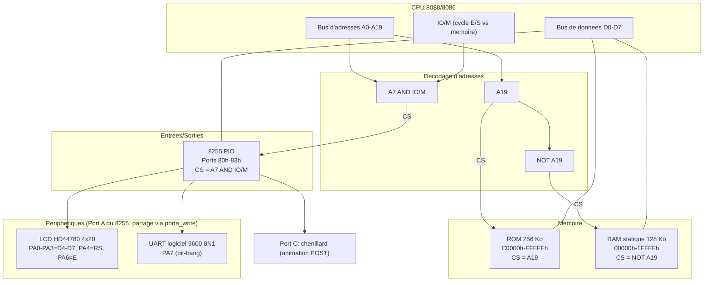

# Solution-01 — 8088/8086 sur breadboard (VE2CUY)

Firmware ROM pour un ordinateur 8088/8086 assemblé sur breadboard par
Alain Boudreault (VE2CUY). Au démarrage, la carte :

1. affiche un écran de démarrage sur un LCD 4×20 pendant 3 secondes ;
2. anime le Port C du 8255 (chenillard) pendant que la ligne UART
   transmet un bandeau de bienvenue ;
3. teste la totalité de la RAM statique (128 Ko) et rapporte le
   résultat (UART + LCD) ;
4. fait un dump hexadécimal des 4 premiers Ko de la ROM (+ les 16
   derniers octets : vecteur de reset et signature) ;
5. reboucle indéfiniment.

Ce cycle sert de "power-on self-test" (POST) pour valider le montage
matériel (8255, RAM, LCD, UART) à chaque mise sous tension.

## Matériel visé

- CPU 8088/8086 (le code est écrit pour être compatible 8086 strict —
  voir `CPU 8086` dans `solution-01.asm` — mais ciblé pour tourner sur
  un vrai 8088)
- ROM 256 Ko, mappée à l'adresse physique `C0000h-FFFFFh`
- RAM statique 128 Ko
- Un 8255 (PIO) : Port A partagé entre le LCD et l'UART logiciel
  (bit-bang), Port C utilisé pour l'animation du POST
- Câblage du Port A (voir l'en-tête de `solution-01.asm`) :
  - `PA0-PA3` → `D4-D7` du LCD
  - `PA4` → `RS` du LCD
  - `PA6` → `E` du LCD (R/W du LCD à la masse)
  - `PA7` → ligne UART (remplace un ancien latch 74LS373 externe)
- LCD HD44780 4 lignes × 20 caractères, piloté en mode 4 bits

Comme le LCD et l'UART se partagent le même octet matériel (le 8255
en mode 0 n'adresse pas le Port A bit à bit), toute écriture sur ce
port passe par `porta_write` (voir `lib/common.asm`), qui ne modifie
que les bits concernés et préserve les autres via une copie fantôme
en RAM.

## Schéma bloc du circuit électronique

Décodage d'adresses (logique simple, sans décodeur dédié — un seul
bit d'adresse suffit à distinguer ROM/RAM, la sélection du 8255 se
faisant sur le bus d'E/S) :

- **ROM** : `CS = A19`
- **RAM** : `CS = NOT A19`
- **8255 (PIO)** : `CS = A7 AND IO/M` (cycle d'E/S, adresse ≥ 80h —
  `A0`/`A1` vont directement aux broches `A0`/`A1` du 8255 pour
  sélectionner Port A/B/C/registre de commande — voir `PORTA`/`PORTB`/
  `PORTC`/`PIO` dans `include/hardware.inc`, ports 80h-83h)



⚠️ Note : la sélection de la ROM ne dépend que de `A19` (pas de
`A18`) — la ROM physique (256 Ko = `A0-A17`) est donc mise en miroir
sur les 512 Ko de la moitié haute de l'espace mémoire (`80000h-FFFFFh`)
si `A18` n'est câblé nulle part ailleurs ; le firmware n'utilise que
la fenêtre `C0000h-FFFFFh`. Même remarque pour la RAM (128 Ko, moitié
basse de 1 Mo) : seuls `00000h-1FFFFh` sont réellement testés par
`test_ram` (voir `solution-01.asm`).

## Structure du dossier

```
Solution-01/
├── solution-01.asm       Flux principal (start, test RAM, dump ROM,
│                          animation 8255) + tous les textes/données
├── Directives.md          Cahier des charges du projet
├── Makefile               Automatise l'assemblage (voir Makefile.md)
├── Makefile.md            Explication détaillée du Makefile
├── check_rom.py           Validation structurelle du .bin assemblé
├── .gitignore             Ignore build/ (fichiers jetables de check-modules)
├── include/
│   ├── hardware.inc       Constantes matérielles (8255, adresses RAM
│   │                      des variables partagées)
│   └── delay.inc          Macro `delay_ms` (voir lib/utils.asm)
└── lib/
    ├── common.asm         porta_write (accès partagé LCD/UART au
    │                      Port A) + hex_table
    ├── lcd.asm            Toutes les procédures d'affichage LCD
    ├── uart.asm           Toutes les procédures de transmission UART
    ├── utils.asm          delay_ms_proc (routine derrière la macro)
    └── bin/                (généré) lcd.bin, uart.bin
```

Fichiers générés par `make` (non versionnés, voir `.gitignore`) :
`solution-01.bin`, `lib/bin/lcd.bin`, `lib/bin/uart.bin`,
`lib/utils.bin`, `build/check/*.bin`.

**Règle importante** : tous les `%include` du projet sont écrits comme
des chemins relatifs à **cette racine** (`Solution-01/`), jamais
relatifs au fichier qui fait le `%include` — NASM résout les chemins
par rapport au répertoire courant au moment de l'assemblage. Il faut
donc toujours lancer `nasm`/`make` **depuis ce dossier**, jamais depuis
un sous-dossier.

## Fonctions d'accès au LCD (`lib/lcd.asm`)

| Fonction | Rôle |
|---|---|
| `lcd_init` | Séquence d'initialisation HD44780 standard en 4 bits (4 lignes × 20, curseur off, Clear Display) |
| `lcd_command` / `lcd_data` | Envoie un octet complet (2 quartets) : `lcd_command` = instruction (RS=0), `lcd_data` = caractère (RS=1). Entrée : `AL` |
| `lcd_strobe` | Envoie un quartet déjà prêt et génère l'impulsion `E` (via `porta_write`, jamais un `out` direct — préserve le bit UART) |
| `lcd_print` | Affiche une chaîne terminée par `0` depuis `DS:SI` (pas de padding — le texte doit déjà avoir la largeur voulue) |
| `lcd_line1` … `lcd_line4` | Positionne le curseur DDRAM au début d'une des 4 lignes (convention "type A" pour afficheur 20×4) |
| `lcd_show_line1` … `lcd_show_line4` | `lcd_lineN` + `lcd_print` en un seul appel (entrée : `DS:SI`) |
| `lcd_tx_hex_nibble` / `lcd_tx_hex_byte` / `lcd_tx_hex_word` | Affiche une valeur en hexadécimal majuscule (entrée : `AL` ou `AX`) |
| `lcd_tx_dec3` | Affiche `AX` (0-999) en décimal, toujours sur 3 chiffres avec zéros de tête |
| `lcd_short_delai` / `lcd_delay` / `lcd_delay_long` / `lcd_powerup_delay` | Délais calibrés au plus proche du minimum HD44780 (voir en-tête du fichier pour les marges de sécurité de chacun) |

## Fonctions d'accès à l'UART (`lib/uart.asm`)

Transmission série logicielle (bit-bang, 9600 8N1) sur `PA7`.

| Fonction | Rôle |
|---|---|
| `uart_tx_string` | Transmet une chaîne terminée par `0` depuis `DS:SI` |
| `uart_tx_byte` | Transmet `AL` en 8N1 (bit start, 8 bits LSB en premier, bit stop) via `porta_write` |
| `uart_bit_delay` | Délai d'un bit, calibré (`UART_BIT_COUNT`) pour ~9600 bauds — **valeur mesurée à l'analyseur logique sur ce montage, ne pas modifier sans re-mesurer** |
| `uart_tx_hex_nibble` / `uart_tx_hex_byte` / `uart_tx_hex_word` | Affiche une valeur en hexadécimal majuscule (entrée : `AL` ou `AX`) |

## Outils nécessaires pour produire le `.bin` final

| Outil | Rôle |
|---|---|
| [NASM](https://www.nasm.us/) | Assembleur x86 (`nasm -f bin ...`) — doit être dans le `PATH` |
| GNU Make | Orchestre l'assemblage via le `Makefile` (voir `Makefile.md`) |
| Python 3 | Exécute `check_rom.py` (cible `make check`) |
| Git | Suivi de version du projet |
| Un shell POSIX (`cp`, `mkdir -p`, `rm -f`) | Requis par les recettes du `Makefile` |

```sh
make          # construit tout : ROM complète + modules individuels
make rom      # ROM complète, copiée vers Z:\Partage\Alain\rom.bin
make lib      # modules individuels (lib/bin/lcd.bin, lib/bin/uart.bin, lib/utils.bin)
make check    # assemble la ROM puis valide sa structure (check_rom.py)
make check-modules  # verifie que chaque module s'assemble seul, sans erreur
make clean    # supprime tous les .bin generes
```

Détails complets de chaque cible : voir [Makefile.md](Makefile.md).

## Environnement de travail : session WSL sous VS Code

Le `Makefile` suppose GNU Make + un shell POSIX (`cp`, `mkdir -p`,
`rm -f`). Pour travailler sur ce projet, **ouvrir une session WSL
(Windows Subsystem for Linux) dans VS Code** plutôt qu'un terminal
Windows natif (PowerShell/cmd) :

1. Dans VS Code, ouvrir une palette de commandes (`Ctrl+Shift+P`) →
   **WSL: Connect to WSL** (ou ouvrir un terminal intégré et choisir le
   profil **WSL** dans le sélecteur de shell).
2. Se placer à la racine de ce dossier (`Solution-01/`).
3. Vérifier que `nasm`, `make`, `python3` et `git` sont installés et
   accessibles dans ce shell WSL (`nasm -v`, `make -v`, `python3
   --version`, `git --version`).
4. Lancer `make` (ou toute autre cible) depuis ce terminal WSL.

Travailler sous WSL évite les problèmes de traduction de chemins
(`Z:\Partage\Alain\`, chemins POSIX vs Windows) et de shell
(`cmd.exe` vs `sh`) qui peuvent survenir avec un `make` natif Windows
appelant un shell MSYS/Git Bash.
